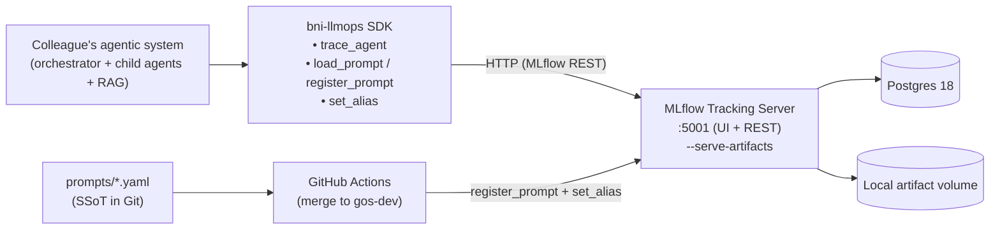

# Architecture

## Coupling rule

Only `src/llmops/_mlflow_adapter.py` imports `mlflow`. All other SDK modules go through the adapter. Enforced via ruff TID253 in CI.

## Why this shape

- **Single source of truth for MLflow coupling** — when MLflow's API changes (or we swap providers), we change one file.
- **Easy testability** — every other module can be unit-tested with the adapter mocked; no MLflow live calls in unit tests.
- **Easy framework extensibility** — the adapter pattern lets us add a Langfuse/Phoenix backend later without rewriting the SDK.
